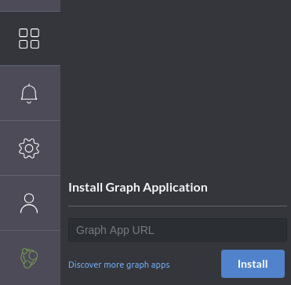
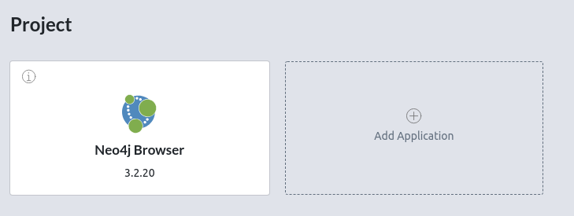
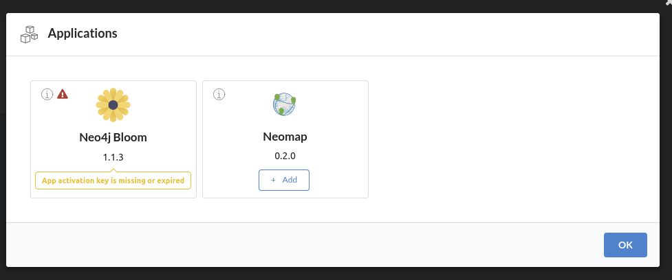

# neo-map

A Neo4J Desktop (React-based) application to visualize nodes with geographical attributes on a map.

## Installation

### Add the app to Neo4jDesktop

#### From tarball

1. Go to the repository [releases](https://github.com/stellasia/neomap/releases)
2. Download the `noemap-<version>.tar.gz`
3. Open neo4j desktop and go to "Graph Applications" view:

	

4. Drag and drop the tarball you downloaded earlier below "Install Graph Application"
5. Trust the application
6. The application is now available and you can add it to your projects:

	

7. Click "Add"

	

## Usage

Read the [tutorial](https://github.com/stellasia/neomap/wiki/NeoMap-Tutorial/) or the [FAQ](https://github.com/stellasia/neomap/wiki/FAQ).

## Want to contribute?

### WARNING

I am a data scientist, not a front-end developer. If someone with expertise with React wants to take a look and suggest improvements, that would be very welcome!

### Developper mode

1. Clone this repo
2. Install dependencies:

        npm install

3. Start the development server:

        npm run start

4. Configure Neo4jDesktop by enabling the development mode in settings with the following paramters:
    - Entry point: `http://localhost:3000`
    - Root path: root of this repository

5. Run tests: install dev dependencies and

        npm run test
